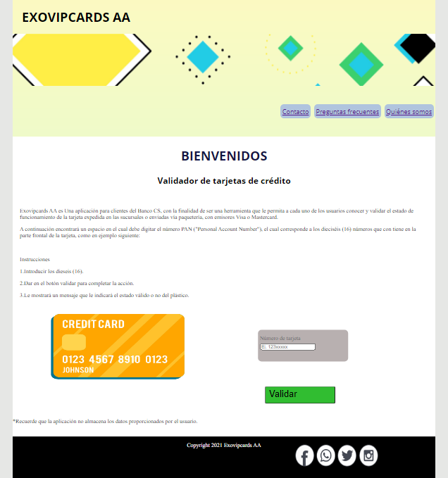
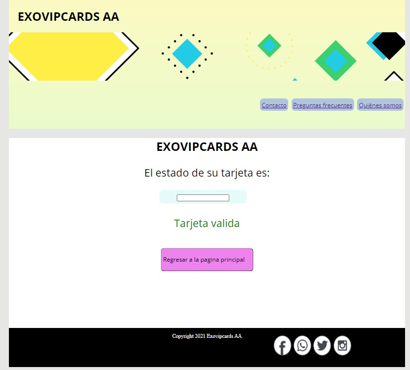
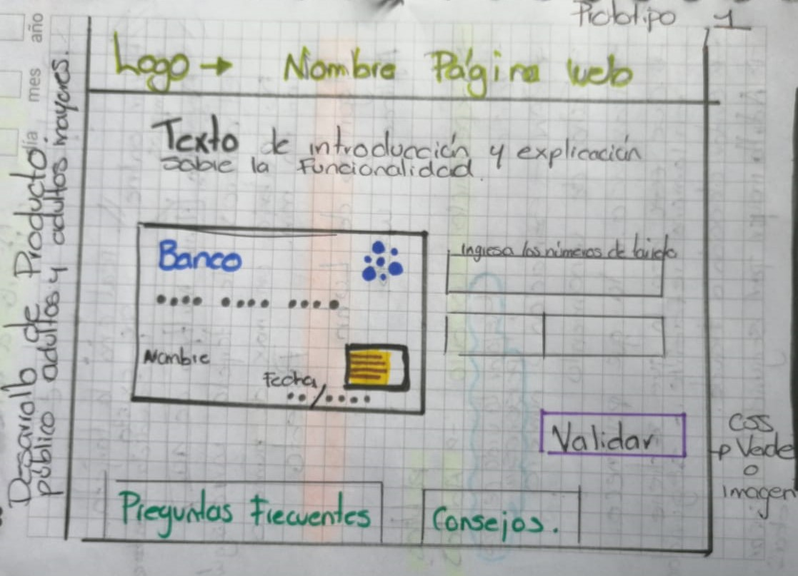
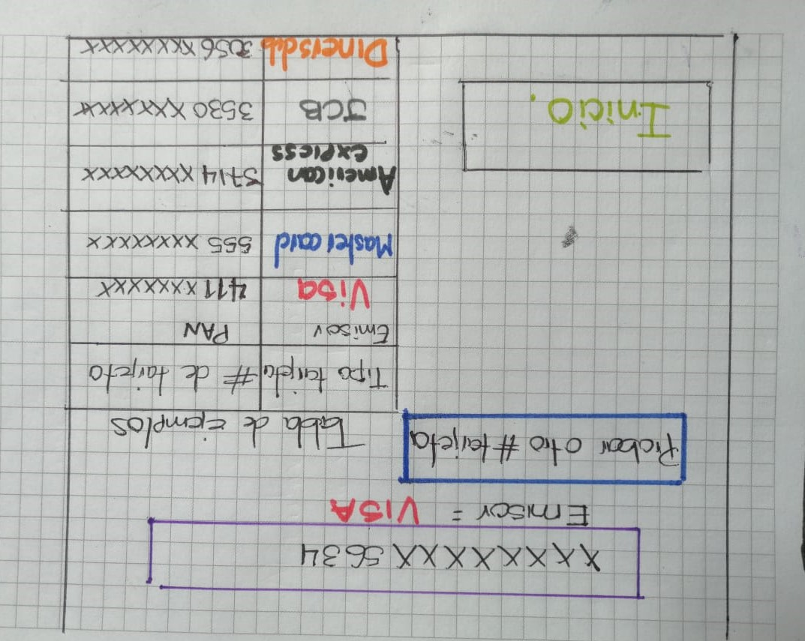
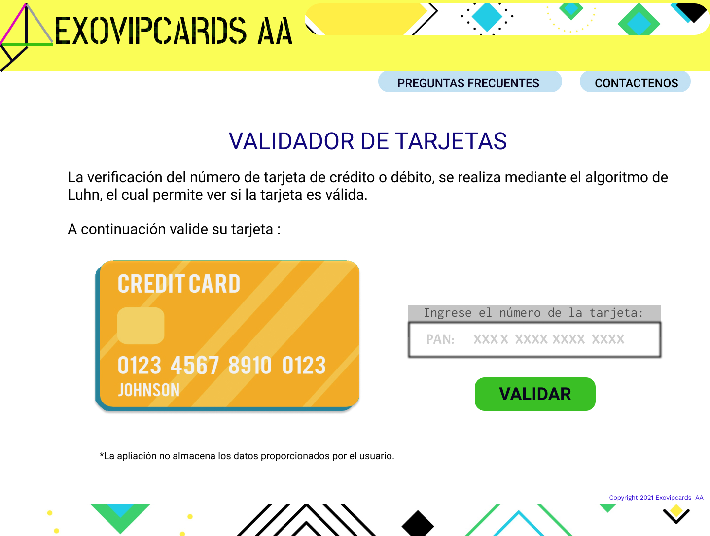
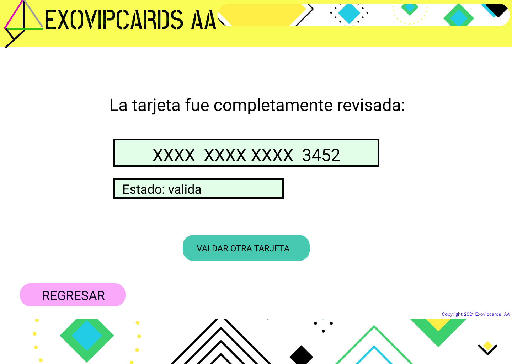

# Tarjeta de crédito válida

## Índice

* [1. Título del proyecto](#1-preámbulo)
* [2. Resumen del proyecto](#2-resumen-del-proyecto)
* [3. Imagen proyecto  ](#3-Imagen-proyecto)
* [4. Experiencia ux ](#4-consideraciones-generales)
* [5. Resumen Feedback](#5-Resumen-Feedback)
* [6. Prototipo final](#6-pistas-tips-y-lecturas-complementarias)

***

## 1. Título del proyecto

El proyecto tiene como titulo EXOVIPCARDS AA.

## 2. Resumen del proyecto

El proyecto tendrá como fin plantear una opción para los clientes de bancos, que desee conocer el estado de la tarjeta de crédito que fue asignada en una sucursal del banco o enviada por paqueteria; al verificar a través del número PAN, si es valida o no.
 

## 3. Imagen proyecto

Imagen final del proyecto:
Vista página N°1
 

Vista página N°2

## 4. Investigación ux

* Los usuarios al que proyecto va dirigido son personas mayores de edad que tienen o estén vinculados con los servicios y productos brindados por una entidad bancaria, lo cual delimita una población adulta para usar la herramienta creada a través de la página EXOVIPCARDS AA.

* El objetivo del usuario que ingresa o utiliza la página EXOVIPCARDS AA, llega con el objetivo de validar si la tarjeta de crédito expedida por la entidad bancaria es válida, para con ello, iniciar su uso en diferentes establecimientos o portales web.

* El proyecto nombrado como EXOVIPCARDS AA; está pensado para dar solución a las dudas frente al estado valido o no, que puediera tener una tarjeta de crédito cuando llega al cliente por parte del banco (de forma presencial o por paqueteria), y el usuario desee conocer si su tarjeta es válida; adicionalmente EXOVIPCARDS AA, garantiza que no almacena los datos proporcionados por el usuario, brindado mayor seguridad y confianza al utilizar esta herramienta de validación de tarjetas de crédito.

Prototipo en papel

## 5. Resumen Feedback

* En el espacio de feedback que se dio con un coach y con compañeras se resaltaron varios aspectos al tener presentes en el ejercicio de diseño del prototipo frente al css:  contraste y alineación de los elementos, sugiriendo manejar una paleta de colores más agradable al ojo del usuario, de acuerdo al tema para el proyecto.
Adicionalmente el manejar iconos e imágenes mas sobrias, que le permitan al usuario navegar más ágilmente en la página sin distractores. 

Prototipo N° 1 y 2 presentados para el feedback.

## 6. Imagen prototipo final

Propotipo final
